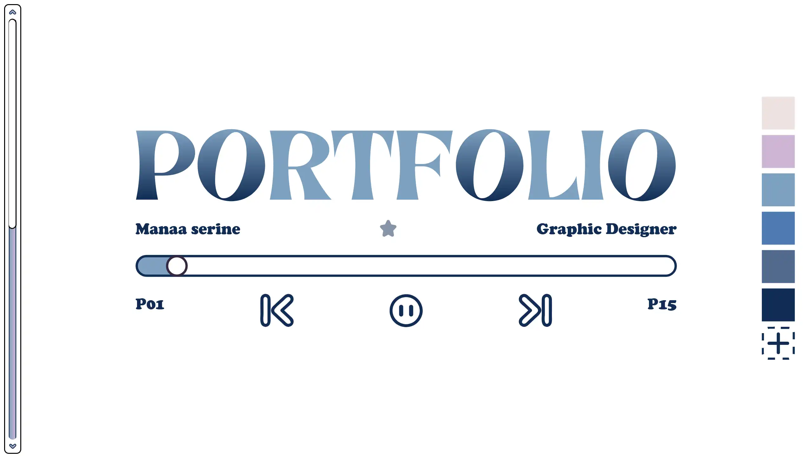
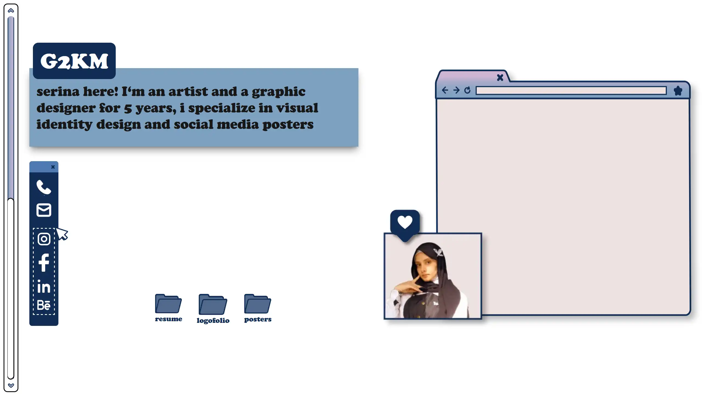
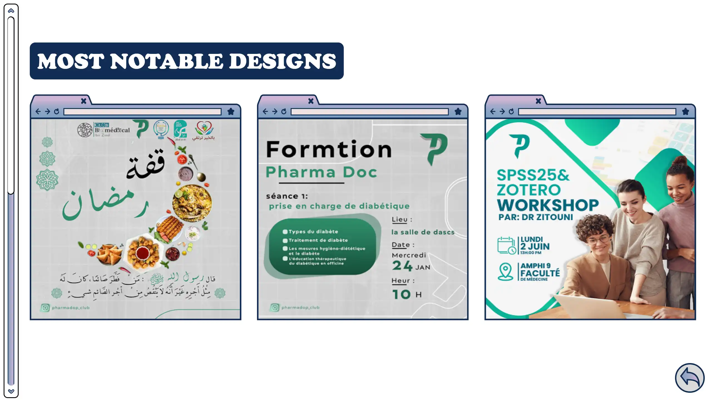
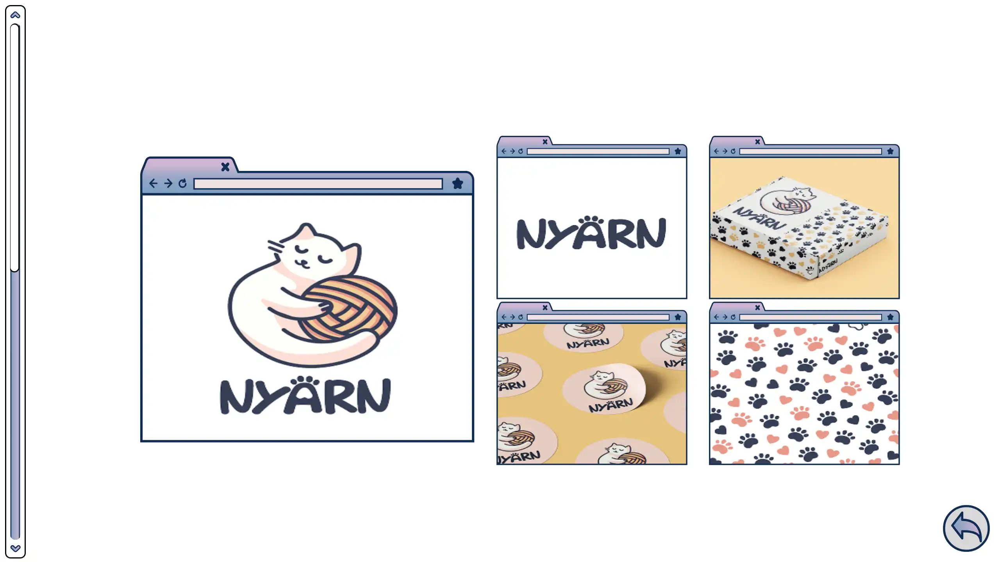
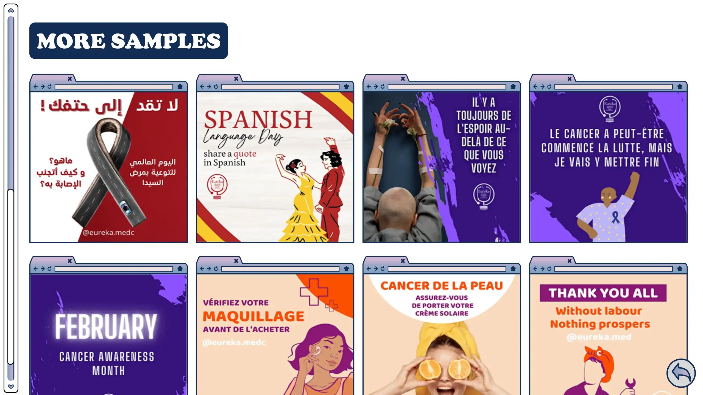
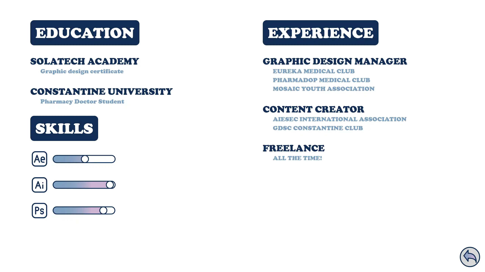

<h1 style="font-family: Arial, sans-serif; font-size: 36px; color: #EC4899; display: flex; align-items: center; border-bottom: 3px solid #EC4899; padding-bottom: 5px;">
    SERINE - The Designer You Need 🎨
</h1>

A modern, fast, SEO-optimized portfolio built with **Next.js**, showcasing **Serine’s best design work**: branding, UI/UX, logofolios, and creative case studies.
Focused on **speed**, **accessibility**, and **clean visual presentation**.

It's on early stages so far, made for my beloved Sister who's a professional designer. And currently postponed for a more unique approach.

---

## Tech Used 🧑‍💻


---

## Features ⚡

* 🚀 **Blazing-fast Next.js performance**
  Image optimization, static routes, caching, and edge delivery.

* 🔍 **Full SEO Optimization**
  Dynamic metadata, OpenGraph tags, structured data, sitemap, robots.txt, and perfect lighthouse scores.

* 🎨 **Design-centric Layout**
  Minimal UI that puts Serine’s work front and center.

* 📱 **Fully Responsive**
  Smooth layout on all screen sizes.

* 🖼️ **Project Galleries**
  High-quality design showcases without performance loss.

---

## Screenshots 📸

<br>


**Hero:** Clean, elegant introduction to Serine’s visual identity.

<br>


**Get 2 Know Me!:** Small glance into Serine's World.

<br>


**Designs:** Main gallery showcasing featured creative work.

<br>


**Logofolio:** Branding, logo exploration, and visual identity work.

<br>


**More Designs:** Extended gallery with additional case studies.

<br>


**Resume:** Simple, accessible CV section.

---

## Project Structure 📂

```plaintext
src/
├── app/                # Next.js 13+ App Router
├── components/         # Reusable UI components
├── sections/           # Portfolio sections (designs, hero, resume...)
├── lib/                # SEO config, utilities
├── styles/             # Global Tailwind setup
└── public/             # Static assets + optimized images
```

---

## SEO Setup 🧠

* Dynamic `<head>` metadata per page
* OpenGraph + Twitter cards
* JSON-LD schema for portfolio and person
* Sitemap & robots.txt auto-generated
* Next.js Image Optimization for WebP
* Preloading fonts + critical CSS
* Clean semantic HTML for accessibility

---

## Development 🛠️

1. **Install**

   ```sh
   npm install
   ```

2. **Run Dev**

   ```sh
   npm run dev
   ```

3. **Build**

   ```sh
   npm run build
   ```

4. **Deploy to Vercel**

   ```sh
   vercel
   ```

---

## License ⚖️

MIT License.

---

## Contact 📬

For business inquiries: **[serine.designs@email.com](mailto:serine.designs@email.com)**
